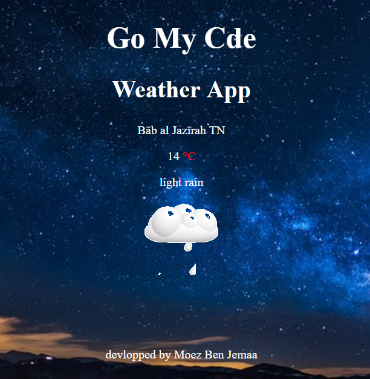

# Weather-location-app
In this mini-project I have developed a  web application that discript the weather condition , the place , and the temperature , as part of my full stack JavaScript training offered by [GOMYCODE Tunisia](https://www.gomycode.tn)
## Project brief
This is a small web application wich does the following:

<strong>User Story</strong>  I can see the weather in my current location.

<strong>User Story</strong>  I can see a different icon or background image (e.g. snow mountain, hot desert) depending on the weather.

<strong>User Story</strong>  I can push a button to toggle between Fahrenheit and Celsius.
  							
<strong>User Story</strong>	I can see a loading spinner while the application is loading the weather data.

The following screenshot shows my App:

    
    

## What I have learned

* How to use geolocation API

* Use jquery to mnipulate the response of Ajax call

